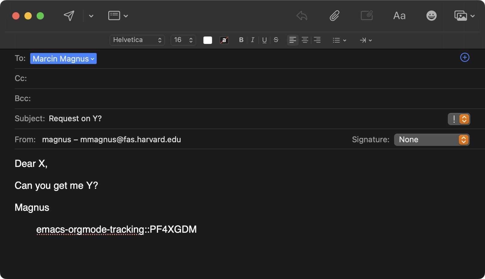

# emacs-orgmode-tracking

Use C-c o r to insert a hashtag into your Org-mode buffer. Then just copy and paste it wherever you need — email, chat, etc. Nothing fancy, brutally simple, yet it works! ;-)

Example tag: emacs-orgmode-tracking::PF4XGDM

# Installation

Simply load the .el file:

	(load-file "~/.emacs.d/plugins/emacs-orgmode-tracking/emacs-orgmode-tracking.el")
